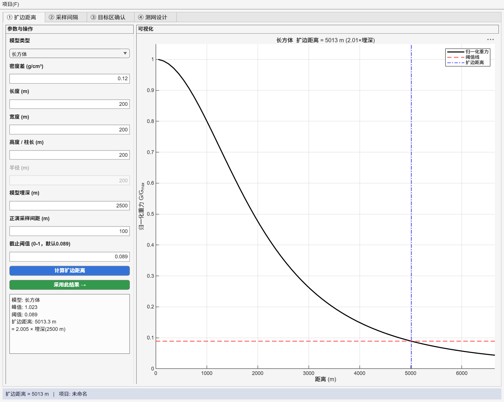
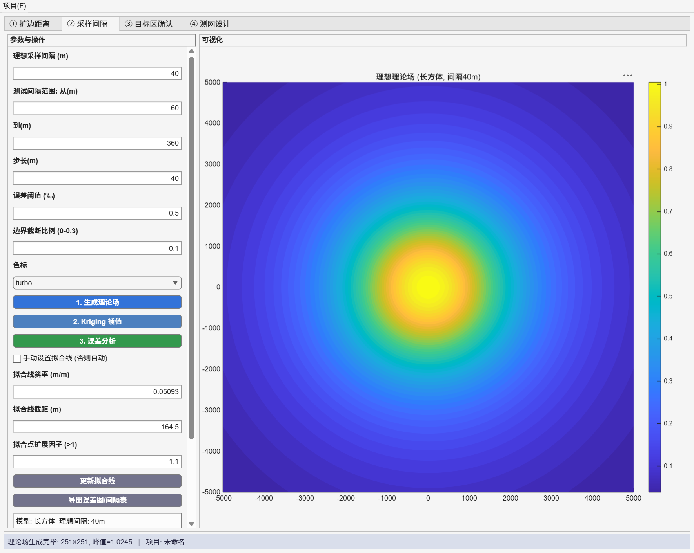
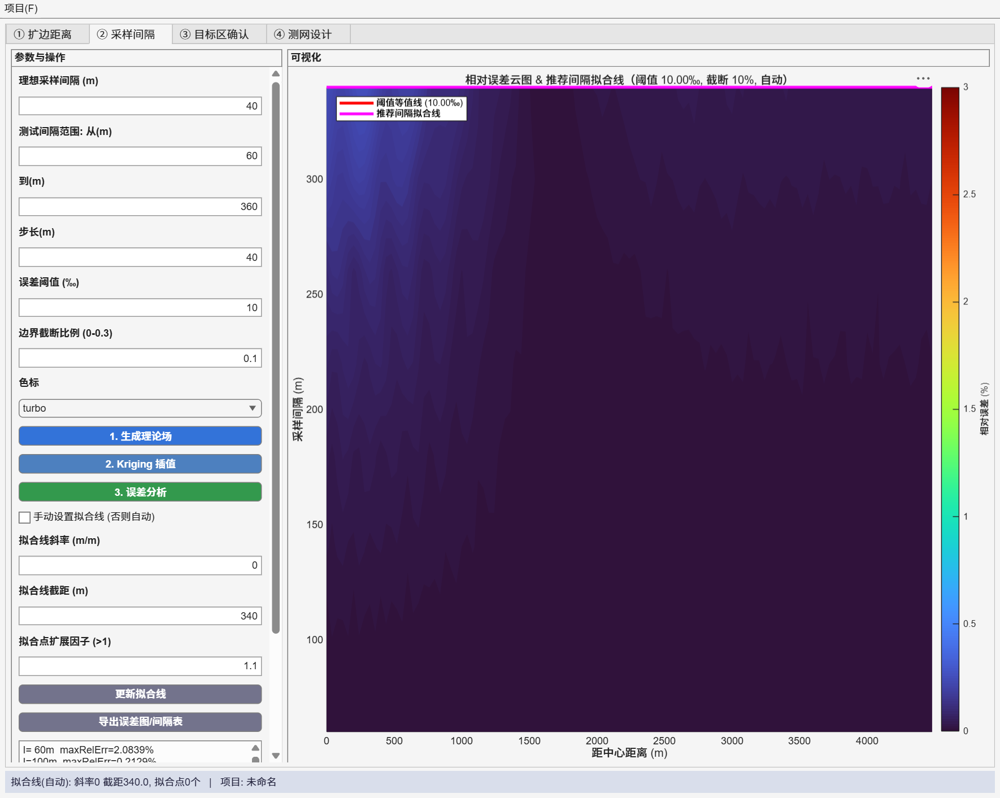
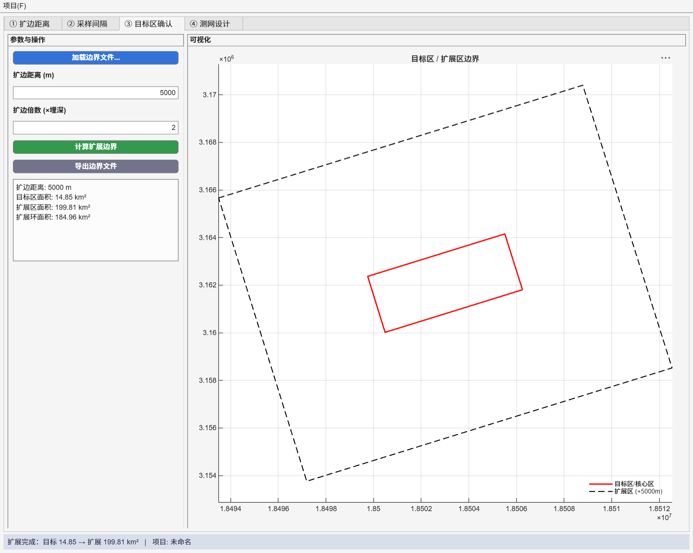
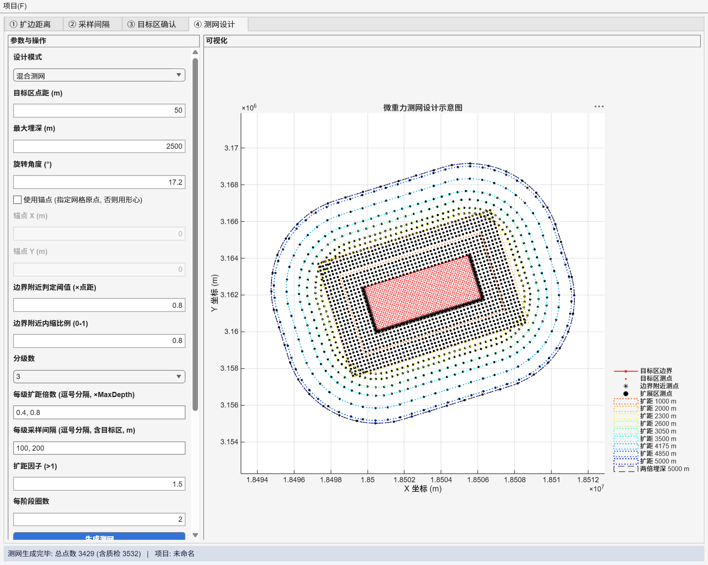

# MicroGravNet · 微重力测网设计系统


> **MicroGravNet** — Microgravity Survey Network Designer · v1.0.1
> 面向微重力勘探的测网正向设计工具：从扩边距离、采样间隔、目标区确认到测网生成，一站式完成。


---

## 概述

MicroGravNet 将微重力勘探测网设计的完整链条整合为一个 **4 步向导式**桌面应用。
用户依次完成四个标签页，即可自动得到全部测点坐标与设计图，支持**渐变 / 分级 / 混合**
三种测网模式。本仓库提供**编译后的独立可执行程序**（无需 MATLAB，仅需免费的
MATLAB Runtime）。

## 功能特性

- **四种重力正演模型**：长方体、垂直圆柱体、水平圆柱体、球体（解析公式）
- **阈值法扩边距离**：归一化重力异常剖面自动反算扩边距离（≈2×埋深）
- **Kriging 误差分析**：以密集正演场为真值，反推核心/目标/扩展三区最优采样间隔（需 Surfer）
- **智能边界扩展**：自动识别矩形/不规则多边形，分别采用保形/边法向扩展
- **三种测网模式**：渐变（周长自适应）、分级（规则环带）、混合（内分级+外渐变）
- **实用细节**：测网旋转、锚点对齐、近边界内缩、一键导出测点 Excel 与设计图 PNG
- **工程续算**：结果保存为 `.mat`，输入值跨会话记忆
- **套件级授权**：RSA-2048 离线验证，本机已激活即免验证

## 设计工作流

```
① 扩边距离确定 → ② 采样间隔确定 → ③ 目标区确认 → ④ 测网设计
   正演+阈值        Kriging误差分析     边界扩展        测点生成+导出
```

---

## 界面运行结果预览

### ① 扩边距离确定
正演模型计算重力异常，按阈值确定扩边距离。


### ② 采样间隔确定
上：理论重力场；下：相对误差云图 + 分区推荐间隔。



### ③ 目标区确认
加载边界并计算扩展区（目标区红 / 扩展区蓝）。


### ④ 测网设计（混合测网）
分层着色测点 + 比例尺 + 指北针 + 统计表。


---

## 系统要求

| 项目 | 要求 |
|------|------|
| 操作系统 | Windows 10 / 11（64 位） |
| MATLAB Runtime | **R2026a**（免费，无需 MATLAB 许可证） |
| 磁盘空间 | 约 2–4 GB（含 Runtime） |
| 内存 | 建议 8 GB+ |
| Golden Software Surfer | 13+（仅「采样间隔」Kriging 功能需要，可选） |

## 下载

| 文件 | 大小 | 说明 |
|------|------|------|
| [`downloads/MicroGravNet_v1.0.1_win64.zip`](downloads/MicroGravNet_v1.0.1_win64.zip) | 774 KB | 解压得 `MicroGravNet.exe`（自包含，需 MATLAB Runtime R2026a） |

> 推荐从 [**Releases** 页](https://github.com/ewencai/MicroGravNet/releases/tag/v1.0.1) 下载最新发布版 `MicroGravNet_v1.0.1_win64.zip`。

## 安装与运行

1. **安装 MATLAB Runtime R2026a**（若尚未安装）：
   从 <https://www.mathworks.com/products/compiler/matlab-runtime.html> 下载
   Windows 版 R2026a 并安装（需管理员权限）；
2. **下载解压**：下载 [`downloads/MicroGravNet_v1.0.1_win64.zip`](downloads/MicroGravNet_v1.0.1_win64.zip)，
   解压得到 `MicroGravNet.exe`，双击运行；
   - 首次启动会解压运行时组件，等待 10–60 秒属正常现象；
3. **首次授权**：弹出授权对话框显示本机**机器码**，将其提供给供应方获取
   `License.key`，粘贴全文并激活。激活信息存于 `%APPDATA%\AppLicenseSystem\`，
   后续启动免验证。本机若已为同套件其他软件激活过，则直接通过。

> 详细安装说明见 [docs/安装程序说明.md](docs/安装程序说明.md)。

## 快速上手（验证安装）

1. 启动后确认标题为 `微重力测网设计系统 (MicroGravNet) v1.0.1`，含 4 个标签页；
2. 「③ 目标区确认」→ 加载一份 `.dat` 边界 → 填扩边距离 → 计算扩展边界；
3. 「④ 测网设计」→ 选「混合测网」→ 填参数 → 生成测网，查看设计图与总点数。

---

## 仓库结构

```
MicroGravNet/
├── README.md
├── downloads/
│   └── MicroGravNet_v1.0.1_win64.zip   ← 解压得 MicroGravNet.exe（需 Runtime R2026a）
├── output/build/     ← 编译元数据（依赖清单、构建日志、splash）
├── screenshots/      ← 四步界面运行截图
├── docs/             ← 用户手册、安装程序说明、软件说明书（含正演公式）
└── resources/        ← 图标 / 横幅 / 启动画面
```

## 文档

- [软件说明书（技术手册）](docs/软件说明书.md) — 概要、技术原理、**正演公式**、参数说明、操作步骤
- [代码说明（架构与模块参考）](docs/代码说明.md) — 目录结构、模块划分、函数接口、数据流
- [用户手册](docs/user_manual.md) — 分步操作与输出格式
- [安装程序说明](docs/安装程序说明.md) — 面向最终用户的安装与授权
- [安装手册（开发者）](docs/installation_guide.md) — 源码环境搭建与编译

## 技术栈

MATLAB App Designer（程序化 UI）· MATLAB Compiler（R2026a 独立部署）·
Golden Software Surfer COM 自动化（Kriging）· RSA-2048 授权

## 许可

本软件为**授权制商用软件**，需有效 `License.key` 方可运行。
仓库内可执行程序仅内嵌 RSA **公钥**用于验签，不含任何私钥或凭据。
未经授权不得用于商业用途。

---

*版本 v1.0.1 · 运行环境 MATLAB Runtime R2026a*
